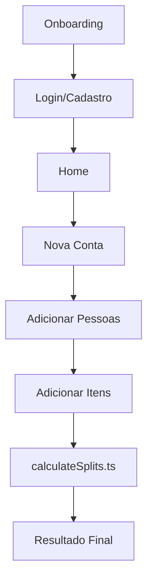
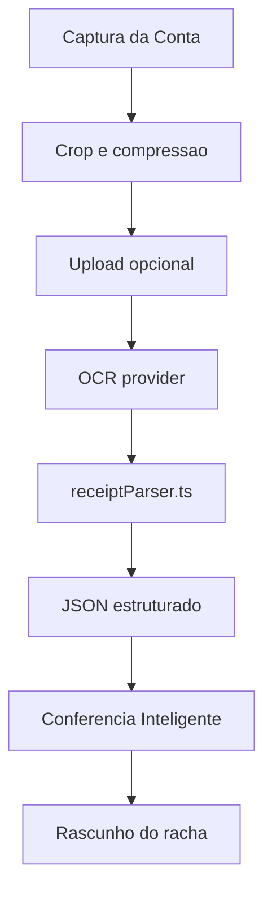
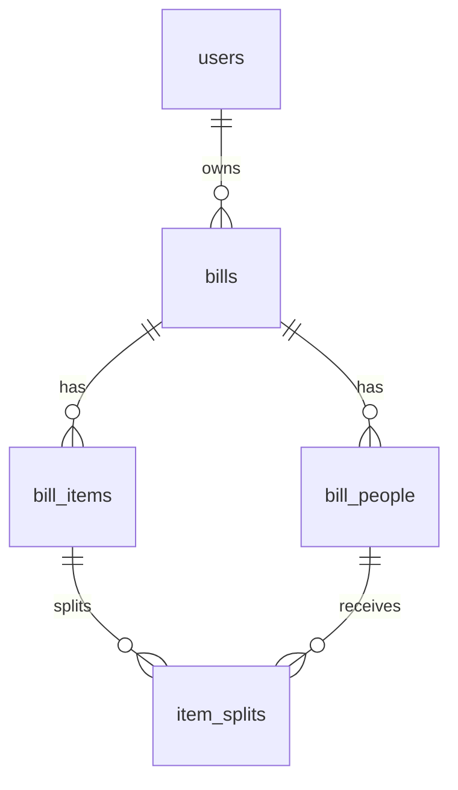
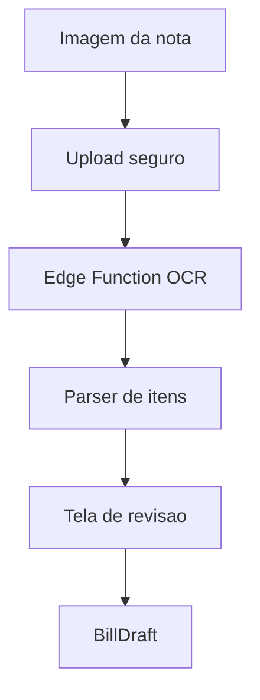

# Arquitetura

## Visao Geral

O Rachaê usa uma arquitetura modular por features, com separacao clara entre UI, estado, servicos de dominio e infraestrutura. A meta e permitir crescimento do produto sem acoplar telas a regras financeiras ou banco.

## Frontend

- Expo + React Native para mobile cross-platform.
- TypeScript strict para contratos seguros.
- NativeWind para estilo rapido e consistente.
- React Navigation para fluxo entre onboarding, auth e app.
- Componentes reutilizaveis em `src/components/ui`.

## Backend

- Supabase Auth para autenticacao.
- Supabase Postgres para persistencia.
- Supabase RLS para isolamento por usuario.
- Futuras Edge Functions para OCR, IA e tarefas sensiveis.

## Fluxo Atual

## Fluxo OCR E IA

Sprint 2 adiciona um pipeline isolado para leitura automatica de comandas:

O OCR fica atras de `receiptOcr.ts`. O app usa endpoint remoto quando `EXPO_PUBLIC_RECEIPT_OCR_ENDPOINT` existe e usa provider demo quando nao ha backend configurado.

O parser de IA fica em `receiptParser.ts`. Ele aceita resposta JSON remota, normaliza campos monetarios em centavos, valida total e adiciona warnings de conferencia.

## Engine Financeira

`src/services/billing/calculateSplits.ts` recebe um `BillDraft` e retorna um `SplitSummary`.

Regras:

- Cada item e dividido apenas entre seus participantes.
- Taxa e desconto sao proporcionais ao subtotal de cada pessoa.
- Desconto e limitado ao subtotal para evitar valores negativos.
- Arredondamento usa centavos e distribuicao deterministica de restos.

## Estados Globais

- `appStore`: onboarding e preferencias.
- `authStore`: sessao, usuario, login, cadastro, logout e modo demo.
- `billStore`: rascunho da conta manual.

## Banco De Dados

Tabelas iniciais:

- `users`
- `bills`
- `bill_people`
- `bill_items`
- `item_splits`

Relacionamento principal:

## Autenticacao

O cliente Supabase usa:

- `AsyncStorage` para persistencia de sessao mobile.
- `autoRefreshToken`.
- `persistSession`.
- `detectSessionInUrl: false`.
- `processLock` para seguranca em ambiente React Native.

## OCR Futuro

OCR deve ser implementado fora do cliente, preferencialmente em Edge Function:

## IA Futuro

IA deve atuar como assistente, nunca como fonte unica de verdade:

- Sugerir nomes/categorias.
- Detectar taxa e desconto.
- Sugerir quem consumiu itens recorrentes.
- Explicar divergencias de calculo.

Todo uso de IA deve ter revisao humana antes de salvar ou cobrar.

## Processamento De Imagens

- Cliente captura imagem.
- Backend recebe imagem com auth.
- OCR extrai texto.
- Parser transforma texto em itens estruturados.
- IA pode sugerir normalizacao.
- Usuario revisa e confirma.

## Integracoes Futuras

- Pix.
- WhatsApp.
- Google Vision.
- OpenAI.
- Analytics.
- Push notifications.
- Supabase Realtime para rachas colaborativos.

## Escalabilidade

- Regras financeiras puras e testaveis.
- Banco relacional com indices por dono e bill.
- RLS como primeira camada de seguranca.
- Features isoladas para onboarding de novos devs.
- Documentacao obrigatoria por sprint.
